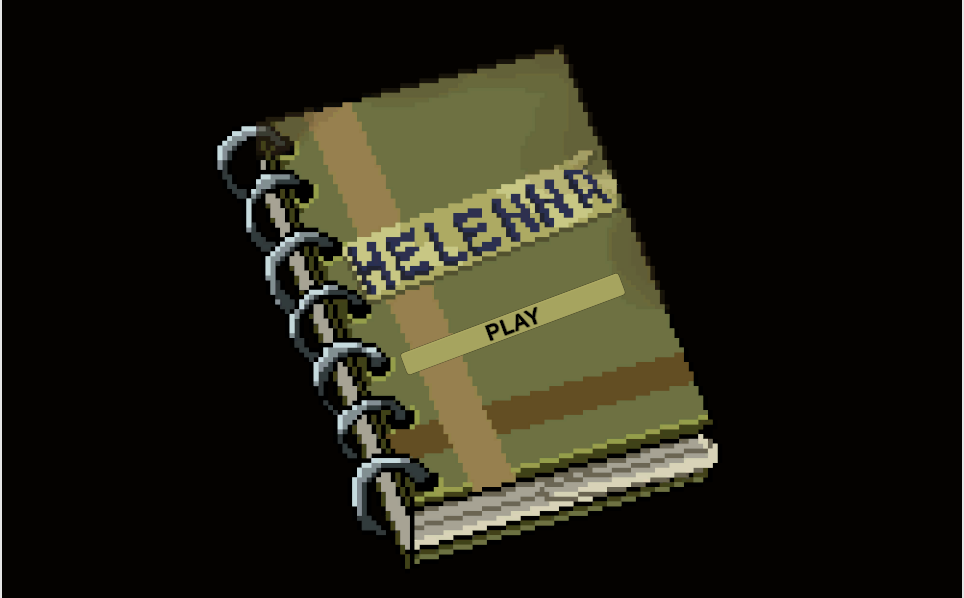
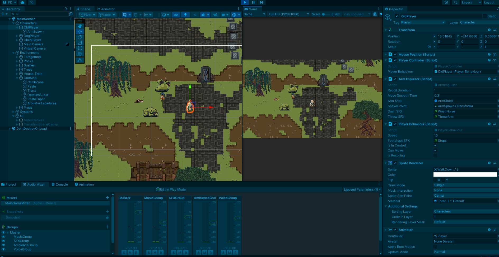

# Helenna

**Helenna** es un juego de aventuras 2D, con vista top/down, basado en mecánicas cooperativas. Controlarás a tres personajes con habilidades únicas, alternando entre ellos para resolver puzzles y sortear obstáculos. El objetivo: recolectar las notas de Helenna, la mujer desaparecida del protagonista, Harold. A través de estas pistas, intentarás descubrir su paradero y desentrañar el misterio que rodea su desaparición.
Este proyecto fue desarrollado como un prototipo integrador para la universidad, y posteriormente convertido en un vertical slice funcional, con el objetivo de aplicar principios de diseño de juegos, programación modular, arquitectura basada en estados y control de versiones con Git, como parte de mi desarrollo profesional y académico.
> **Status**: 🚧 En desarrollo activo (vertical slice en progreso)
---

## Características principales

- Cambio dinámico de personaje (TAB)
- Mecánicas únicas para cada personaje:
  - Harold: lanza su brazo para empujar o atraer objetos
  - Nina: escala superficies y accede a zonas elevadas
  - Rex: recoge objetos con su boca y atraviesa espacios estrechos
- Sistema de estados desacoplado para cada personaje
- Interacción dinamica entre los personajes y elementos del entorno 
- Música adaptativa con transiciones suaves y elementos foley
- Lectura de notas que interrumpe el juego y cambia el estado general

---

## Capturas




---

## Cómo jugar

👉 Las instrucciones completas de jugabilidad y controles están disponibles en 
[Mi página de Itchio](https://franco-dominguez.itch.io/helenna-prototype)

---

## Tecnologías utilizadas

- **Motor**: Unity 2022.x (LTS)
- **Lenguaje**: C# (Programación orientada a objetos y patrones de diseño)
- **Herramientas y paquetes utilizados**:
  - Cinemachine (control de cámara)
  - TextMeshPro (renderizado de texto)
  - Audio Mixer (música adaptativa y efectos)
  - Git & GitHub (control de versiones)

---

## Instalación y ejecución

1. Cloná el repositorio:
2. Abrí el proyecto con Unity (versión 2022.3 o compatible)
3. Iniciá desde la escena MenuScreen ubicada en Assets/Scenes
---

## Autoría

-Desarrollado por **Franco Dominguez**  
-Pixel Art por **Tomas Sobrado**  
[LinkedIn – Franco Dominguez](https://www.linkedin.com/in/franco-dom%C3%ADnguez-a21101274/)

---
```bash
git clone https://github.com/DominguezFranco28/Helenna.git

